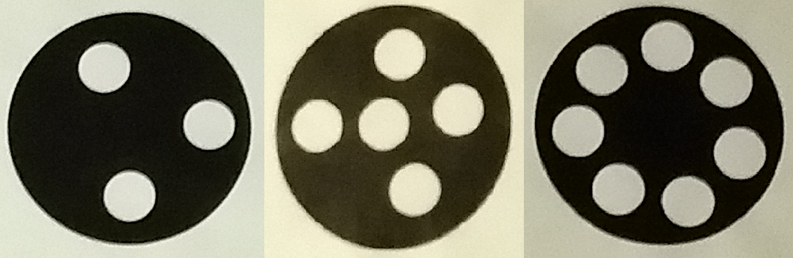

# Mono Camera Robot Tracking

## Table of content

* Project Description
  * Uses circles for the tracking
  * Images of project
* Setup Hardware
* Setup Software
  * Language and dependencies
  * Setup CameraInformation
  * Setup RobotTracking
  * Use the find_robot function
  * Can't find the camera's information?
  * Focus
* Example Program
  * Explanation of the example program
* Personalize extensions
  * RobotResources Interface
  * CircleResources Interface


## Project Description
The purpose of this project is to give a tool for robot tracking which is simple to setup and easy to bring along. An example of use can be in demos for conferences, light weight is preferred for traveling purposes and a simple setup is wanted in a already stressing new environment.
The technology uses just a single camera to track as many robots as wanted. The camera can be placed everywhere and does not need a fixed location, nor does it need to be placed at a known height, angle to the ground, or viewing-angle of the track.
It is as easy as:
1. setup camera at random
2. Point camera at the track
3. Connect camera to the computer
4. Start program.

**Notice:** Read *Setup Hardware* to see what is needed beforehand for the camera to track the robots.

### Uses circles for the tracking
Only a single camera is needed and can be placed at random. This is possible because other objects is used in this information's stead.
The objects used is circles. These circles is split up into two categories:
* Calibration Circles
* Robot Circles

The two kind of circles look the same but are separated by the ID on them (Number of smaller circles inside).
An example of circles can here be seen with the ids 3, 5, and 7 correspondingly.


*OBS!: Where the smaller circles are placed does not matter as long it is inside of the outer circle.*


**Calibration Circles**

The Calibration Circles is used to calibrate the camera. These circles' coordinates must be fixed throughout the duration of the program - Each circle's coordinate and size must be accessible for the program (See "Setup Software").
It must be possible for the camera to see at least three Calibration Circles for it to calibrate. As long as this is met will the camera be able to find its own coordinates, height, angle, and viewpoint. An image with three Calibration Circles places on the ground can be seen after this section. The circles can be further apart or closer to each other depending on the environment, the only requirement is that they are not placed on a slope.


*OBS!: It is only when calibrating that the Calibration Circles must be visible. The circles can be hidden by e.g. the robots afterwards.*


**Robot Circles**

The Robot Circles is used to track the robots. The camera must be able to see at least three circles on a single robot before tracking is possible. The circles can with advantage be placed on each side of a robot to maximize the likelihood of the camera seeing three of them. Each circle's size and placement on the robot must be accessible for the program (See "Setup Software).


### Images of the project

Image of the setup with the camera pointing at a track with a robot on it:


Image of the track seen from the camera together with the detected coordinates written to a terminal:


Image of the circles being tracked in the image:


## Setup Hardware
**One** of the following cameras-types can be used when setting up the Hardware:
1. USB Camera
2. HDMI Camera

The USB Camera can be connected directly to the PC and does not require extra equipment.

The HDMI Camera probably needs the following part:
* HDMI-To-HDMI or MicroHDMI-To-HDMI
* HDMI-To-USB converter

The extra converters for the HDMI Camera is required because a computer's HDMI-port only is an output and cannot take a HDMI-signal in from the camera. The HDMI signal needs, therefore, to be converted to an USB-signal which the PC can take as an input signal.

*OBS!: Higher resolution means better tracking BUT slower performance. Larger circles means better tracking as well*

*OBS!: Multiple cameras can be connected to the program in case the track is too large.*


## Setup Software
The following steps is required to get this project running:
1. Install Python
2. Install Dependencies
3. Setup CameraInformation
4. Setup RobotTracking
5. Use the find_robot function

The help have been extended with the following descriptions:
* Can't find the cameras' information?
* Focus


### Language and dependencies
This project uses **Python 3.6** or higher. The following libraries is used in the project and must be installed for python before use:
* Random (default)
* Operator (default)
* Time (default)
* Math (default)
* Copy (default)
* Scikit-learn
* Scikit-image
* Numpy
* Opencv-python

*Hint: Use Pip to install the libraries + the ones with (default) does not need to be installed*


### Setup CameraInformation
CameraInformation is imported from the 'CameraModels.py' file:

```python
from Models.CameraModels import CameraInfo
```

Multiple cameras can be used in RobotTracking - Only a single one is required. Each camera must be initialized as CameraInformation objects. A Logitech-C210 webcam is here initialized:

```python
logitech_prob = { 'view_degrees_vertical': 26.14 }
logitech_cam_info = CameraInfo(address = 0, internal_properties = logitech_prob)
```

The 'address' parameter is defining which address the camera is at. The first cam is at 0, the next at 1, and so on. The address is determined by the order of which the computer have identified them.

There is a full list of 'internal_properties' that can be set:


```python
internal_properties = { 'view_degrees_vertical': None,
                        'view_degrees_horizontal': None,
                        'dpi': None,
                        'focal_length': None,  
                        'focus': None,
                        'radial_distortion': None
                         }
```

Only 'view_degrees_vertical' or 'view_degrees_horizontal' is required to set. 'focus' will auto-calibrate if not set. 'Radial_distortion' si used if there is a large radial distortion for the camera.

**Notice:** The list of internal properties may be changed later on. The viewing degrees, focus, and radial_distortion are fixed.


### Setup RobotTracking
RobotTracking is imported from the 'Robot.py' file:

```python
from Robot import RobotTracking
```

Together with two more classes that provides the robot and circle information for the tracking to work:

```python
from Resources import RobotResources, CircleResources
```

An instance of each Resource file needs to be created:

```python
circle_info = CircleResources()
robot_info = RobotResources()
```

The RobotTracking can not be initialized with a list of the cameras and the two resource objects:

```python
tracking = RobotTracking([logitech_cam_info], circle_info, robot_info)
```

After the RobotTracking initialization will the cameras be calibrated and ready to detect the robots.
It is also possible to get visual feedback from the cameras to see if everything is working properly. Visual feedback can be done by setting a parameters in the initialization:

```python
tracking = RobotTracking([logitech_cam_info], circle_info, robot_info, visual_feedback = True)
```


### Use the find_robot function
Everything has now been set up and the robots can be found. This is simply done by calling the function:

```python
position = tracking.find_robot()
```

The function will return a list of each robot's position. The returned list from an example with a single robot can be seen here:

```python
position = [ { 'model': '1', 'position': { 'x': 100, 'y': 55, 'z': 0, 'r': 0.8 } } ]
```


### Can't find the camera's information?
Can't find the required camera information on the internet? No problem! The information can be found manually with a bit of work. A help function is available in the program to make this manual setup easier.

The function can be found in "*ExtraHelpTools.py*" as the class "*CameraInformationHelpTool*". There is two functions in this class that can be used to find the information necessary for calibrating the camera:
* get_viewing_angle_height(object_height, length_from_camera)
* get_viewing_angle_width(object_width, langth_from_camera)

This is how the functions is used:
1. Decide on a viewing angle you want to find (height in this example)
2. Find a object (e.g. a piece of paper) and measure its height
3. Start the camera you want to find the information for (NOT with the program, but just to see what it sees)
4. Move the object you chose closer/farther to/from the camera until the top and bottom of the object hits the top and bottom of the image frame
    * See the two images under these step to see an example of this
5. Measure the length from the camera when *step 4* is met
6. Plot the measured height and measured length from camera into the function. It will return the viewing angle used for the camera information
    * In this case 'view_degrees_vertical'

Example code:

```python
view_degree_vertical = CameraInformationHelpTool.get_viewing_angle_height(201, 550)
camera_prob = { 'view_degrees_vertical': view_degree_vertical }
camera_info = CameraInfo(address = 0, internal_properties = camera_prob)
```

The object in the image frame:


The object in the image aligning with the to top and bottom of the frame:


### Focus
The focus will automatically be calibrated if nothing else has been defined in the camera properties. This auto-focus will take a bit of time each time the program starts and does not guarantee the best focus. The focus can also be manually set if a faster upstart time or better calibration is wanted. The auto and manual way of calibrating the focus can be seen in the following two code snippets.

Auto Calibration:
```python
camera_prob = { 'view_degrees_vertical': view_degree_vertical,
                'focus': None }
camera_info = CameraInfo(address = 0, internal_properties = camera_prob)
```

The focus will per default be set to 'None', this example is to show that the Auto calibration is done when the focus parameter has not been set.

Manual Calibration:
```python
camera_prob = { 'view_degrees_vertical': view_degree_vertical,
                'focus': 150 }
camera_info = CameraInfo(address = 0, internal_properties = camera_prob)
```

The focus have in this example been set to 150. The focus value can be every integer between *0 and 255*.


## Example Program
An example file is available to show how the project can be set up and used in a small program. The program prints the robots' position to the terminal.

The example can be found in the file "Example.py". The code will be explained here to give an insight into how it works. The explanation starts from the top and moved down.

### Explanation of the Example program

**Imports**

Four classes is central for setting up and using the project.
The first on is the class that handles the information for the cameras:

```python
from Models.CameraModels import CameraInfo
```

And the second one is the class for tracking the Robots:

```python
from Robot import RobotTracking
```

The two last ones is the 'RobotResources' and 'CircleResources'. These two classes does not need to be imported from this file but can be customized by the user (See: Personalize extensions). The 'RobotResources' is the class that provides information about where the circles has been placed on each robot. The 'CircleResources' is the class that provides information about the type, size, and other relevant information about the different circles that can be found in the image frame.

```python
from Resources import RobotResources, CircleResources
```


**Setting up the camera**

The first step in setting up RobotTracking is to define the cameras with CameraInfo. In the example have a single camera been defined:

```python
logitech_prob = { 'view_degrees_vertical': 26.14 }
logitech_cam_info = CameraInfo(address = 0, internal_properties = logitech_prob)
```

In this case has the properties for a Logitech camera been defined. The camera can be found at index zero because it is the first camera that the computer have detected at startup.


**Setting up the robot tracking**

Three pieces of information is required for initializing the RobotTracking

* Cameras information
* Circle Resource Object
* Robot Resource Object

Multiple cameras can be used if the track is too large for a single camera to keep control of.
Initializing a RobotTracking object:

```python
tracking = RobotTracking([logitech_cam_info], circle_info, robot_info, visual_feedback = True)
```

The 'visual_feedback' is per default 'False'. When set to true, the tracking will start up a window for each camera with its frame in it. Each frame will show relevant information and can be used for debugging purposes.


**Using the robot tracking**

The following code will keep finding the robots' position and writing them to the terminal.

```python
while True:
    timestamp = time.time()
    robot_list = tracking.find_robots()

    if robot_list == -1: break

    for robot in robot_list:
        print(robot)
```


## Personalize extensions

It is possible to personalize the two resource files:
* RobotResources
* CircleResources

There is a high possibility that you do not want to have the circle or robot information hardcoded into the program. Having these information synchronized with at text-file or a database may bare more suitable for the application.

The Two resource files can, therefore, be changed at will. The only necessary thing is that the personalized resources complies with their interfaces.

**Notice:** These interfaces may be extended in the future as the project gets closer to a version 1.

### RobotResources Interface
The RobotResources interface consists of the following functions:

* get_by_id(robot_id)
* get_dimensions_by_id(robot_id)
* get_circle_by_id_and_circle_number(robot_id, cirlce_number)
* get_circle_placement_by_id(robot_id, circle_number)

The robot_id and circle_number is found in the CircleResources.
See the dictionary structure in RobotResources to get an idea of how the data structure can be organized.


### CircleResources Interface
The CircleResources interface consists of the following functions:

* get_by_id(circle_id)
* get_type_by_id(circle_id)
* get_size_by_id(circle_id)
* get_coordiante_by_id(circle_id)
* get_model_by_id(circle_id)
* valid_id(circle_id)

Only the circles' id is necessary to access each function. See 'Project Description' to learn how the IDs is found.
See the dictionary structure in CircleResources to get an idea of how the data structure can be organized.
